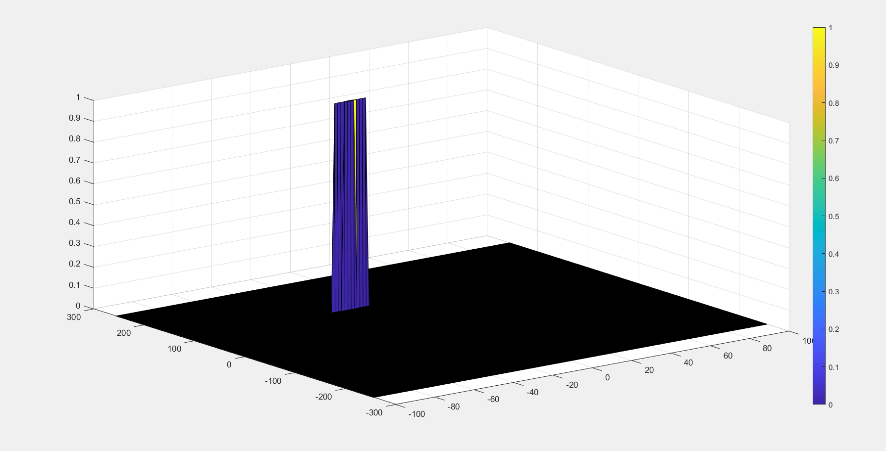

# SFND_RADAR


#### 1. Radar Specifications

* Frequency of operation = 77GHz
* Max Range = 200m
* Range Resolution = 1 m
* Max Velocity = 100 m/s
```
RadarMaxRange = 200;
RangeRes = 1;
RadarMaxVelocity = 100;
c = 3*10^8; %speed of light
```
#### 2.User Defined Range and Velocity of target

*% define the target's initial position and velocity. 
*Note : Velocity remains contant
```
R = 110;
V = -20;
```
#### 3.FMCW Waveform Generation

```
B = c/(2*RangeRes);
Tchirp = (5.5*2*RadarMaxRange)/c;
slope = B/Tchirp;


```

#### 4.Signal generation and Moving Target simulation
```
for i=1:length(t)         
    
 
    %For each time stamp update the Range of the Target for constant velocity. 
    r_t(i) = R + V*t(i);
    td(i) = 2*r_t(i)/c;
    
    %For each time sample we need update the transmitted and
    %received signal. 
    Tx(i) = cos(2*pi*(fc*t(i) + (slope*(t(i))^2)/2));
    Rx(i) = cos(2*pi*((fc*(t(i)-td(i))) + ((slope*((t(i)-td(i))^2))/2)));
    
    %Now by mixing the Transmit and Receive generate the beat signal
    %This is done by element wise matrix multiplication of Transmit and
    %Receiver Signal
    Mix(i) = Tx(i)*Rx(i);
    
end
```

#### 5.RANGE MEASUREMENT

```
%reshape the vector into Nr*Nd array. Nr and Nd here would also define the size of
%Range and Doppler FFT respectively.
signal = reshape(Mix,[Nr, Nd]);

%run the FFT on the beat signal along the range bins dimension (Nr) and
%normalize.
signal_fft = fft(signal,Nr)/Nr;

% Take the absolute value of FFT output
signal_fft = abs(signal_fft);

% Output of FFT is double sided signal, but we are interested in only one side of the spectrum.
% Hence we throw out half of the samples.
signal_fft = signal_fft(1:Nr/2);
```

#### 6.RANGE DOPPLER RESPONSE

* The output of the 2D FFT is an image that has reponse in the range and doppler FFT bins
* it is important to convert the axis from bin sizes to range and doppler based on their Max values.
```
Mix=reshape(Mix,[Nr,Nd]);

% 2D FFT using the FFT size for both dimensions.
sig_fft2 = fft2(Mix,Nr,Nd);

% Taking just one side of signal from Range dimension.
sig_fft2 = sig_fft2(1:Nr/2,1:Nd);
sig_fft2 = fftshift (sig_fft2);
RDM = abs(sig_fft2);
RDM = 10*log10(RDM) ;
```

#### 7.Target Cells and Gaurds Cell.

selecting the target cells is done by practice and trys to et the best result for the output

*1-set the number of Training cells for each dimension Tr and Td. pick the number of guard cells Gr and Gd.
*2-pick an offset.

```
%Select the number of Training Cells in both the dimensions.
Tr = 10;
Td = 8;

%Select the number of Guard Cells in both dimensions around the Cell under 
%test (CUT) for accurate estimation
Gr =4;
Gd=4;
% offset the threshold by SNR value in dB
offset = 1.2;
```
#### 8.CFAR implementation

1-Slide the Cell Under Test (CUT) across the complete cell matrix
2-Select the grid that includes the training, guard and test cells. Grid Size = (2Tr+2Gr+1)(2Td+2Gd+1).
3-The total number of cells in the guard region and cell under test. (2Gr+1)(2Gd+1).
4-This gives the Training Cells : (2Tr+2Gr+1)(2Td+2Gd+1) - (2Gr+1)(2Gd+1)
5-Measure and average the noise across all the training cells. This gives the threshold
6-Add the offset (if in signal strength in dB) to the threshold to keep the false alarm to the minimum.
7-Determine the signal level at the Cell Under Test.
8-If the CUT level > threshold assign % it a value of `1`, else equate it to `0`.
```


%Create a vector to store noise_level for each iteration on training cells
noise_level = zeros(1,1);

% Use RDM[x,y] as the matrix from the output of 2D FFT for implementing
% CFAR
RDM =RDM/max(max(RDM));
max_T =1;

for i = Tr+Gr+1:(Nr/2)-(Gr+Tr)
    for j = Td+Gd+1:Nd-(Gd+Td)
        noise_level = zeros(1,1);
        for p =i-(Tr+Gr) :i+Tr+Gr
            for q = j-(Td+Gd):j+Td+Gd
            
            if(abs(i-p)>Gr || abs(j-q)>Gd)
                noise_level= noise_level +db2pow(RDM(p,q));
            end
            
            end
        end
        threshold = pow2db(noise_level/(2*(Td+Gd+1)*2*(Tr+Gr+1)-(Gr*Gd)-1));
        threshold = threshold + offset;
        CUT=RDM(i,j);
        
        if(CUT<threshold)
            RDM(i,j)=0;
        else
            RDM(i,j)= max_T;
        end
    end
end

```
#### 9.Keep map size
* loop on the edges and set those values to zero
*few cells will not be thresholded. To keep the map size same, set those values to 0

```
for i = 1:(Nr/2)
    for j = 1:Nd
       if (i > (Tr+Gr))& (i < (Nr/2-(Tr+Gr))) & (j > (Td+Gd)) & (j < (Nd-(Td+Gd)))
           continue
       end
       RDM(i,j) = 0;
    end
end
```
